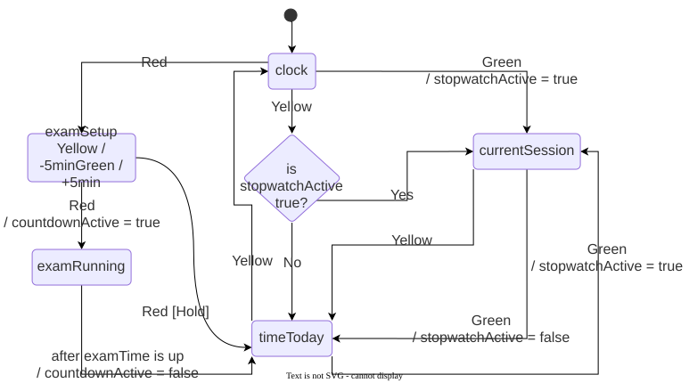

# **Traffic Light Desk Timer [WIP]**
A traffic-light-themed desk clock and timer that tracks study sessions, with a countdown timer for exam practice.

**States**\
clock: Displays current time.\
currentSession: Stopwatch for tracking study time in current session.\
timeToday: Displays total accumulated study time for the day, updates live.\
examRunning: Countdown timer for practice tests.

### **Bill of Materials**
| Item | Qty | Unit Cost (USD) | Total Cost (USD) | Source |
| --- | --- | :---: | :---: | --- |
| Arduino Nano V3 CH340 | 1 | 1.82 | 1.82 | Taobao: 深圳市轩特佳电子
| 30mm Arcade Button (Red) | 1 | 0.28 | 0.28 | Taobao: 华宇动漫三和清水
| 30mm Arcade Button (Yellow) | 1 | 0.28 | 0.28 | Taobao: 华宇动漫三和清水 
| 30mm Arcade Button (Green) | 1 | 0.28 | 0.28 | Taobao: 华宇动漫三和清水
| LCD 1602 Display with I2C (White Text on Black Backlight) | 1 | 2.51 | 2.51 | Taobao: 深佳显LCD液晶屏
| Buzzer module | 1 | 0.50 | 0.50 | Taobao: risym旗舰店
| DS3231 AT24C32 Module with I2C | 1 | 1.27 | 1.27 | Taobao: 一越电子
| 4.7k Ohm Resistor | 2 | 0.0034 | 0.0068 | Taobao: 海雀数码专营店
| Breadboard Layout Solderable PCB 2.54mm Pitch (52x90mm) | 1 | 2.29 | 2.29 | [Sun Cheong Computer Co., Ltd](https://scccltd.com/products/breadboard-layout-solderable-pcb-2-54mm-pitch-52-90mm)
| 2.54mm Pitch Pin Female Header 1x40 | 1 | 0.64 | 0.64 | [Sun Cheong Computer Co., Ltd](https://scccltd.com/products/2-54mm-pin-header-socket-connectors?variant=47814845431959)

Total Cost: 10 USD (to nearest dollar)
