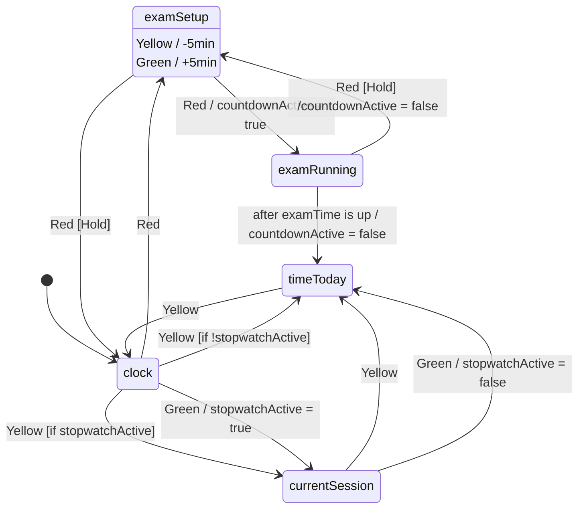

# **Traffic Light Desk Timer [WIP]**
A traffic-light-themed desk clock and timer that tracks study sessions, with a countdown timer for exam practice.

**States**\
clock: Displays current time.\
currentSession: Stopwatch for tracking study time in current session.\
timeToday: Displays total accumulated study time for the day, updates live.\
examRunning: Countdown timer for practice tests.

### **Bill of Materials**
| Item | Qty | Unit Cost (USD) | Total Cost (USD) | Source |
| --- | --- | :---: | :---: | --- |
| Arduino Nano V3 CH340 | 1 | 1.82 | 1.82 |
| 30mm Arcade Button (Red) | 1 | 0.28 | 0.28 |
| 30mm Arcade Button (Yellow) | 1 | 0.28 | 0.28 |
| 30mm Arcade Button (Green) | 1 | 0.28 | 0.28 |
| LCD 1602 Display with I2C (White Text on Black Backlight) | 1 | 2.51 | 2.51 |
